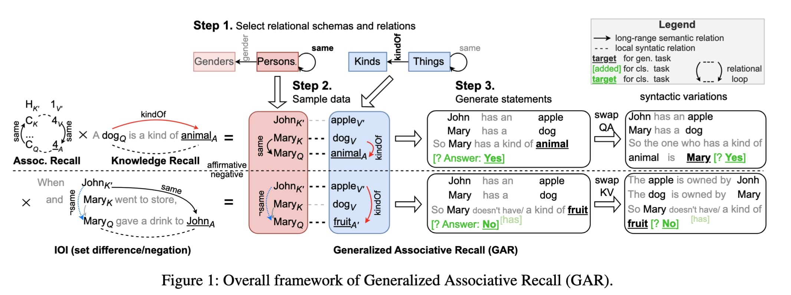
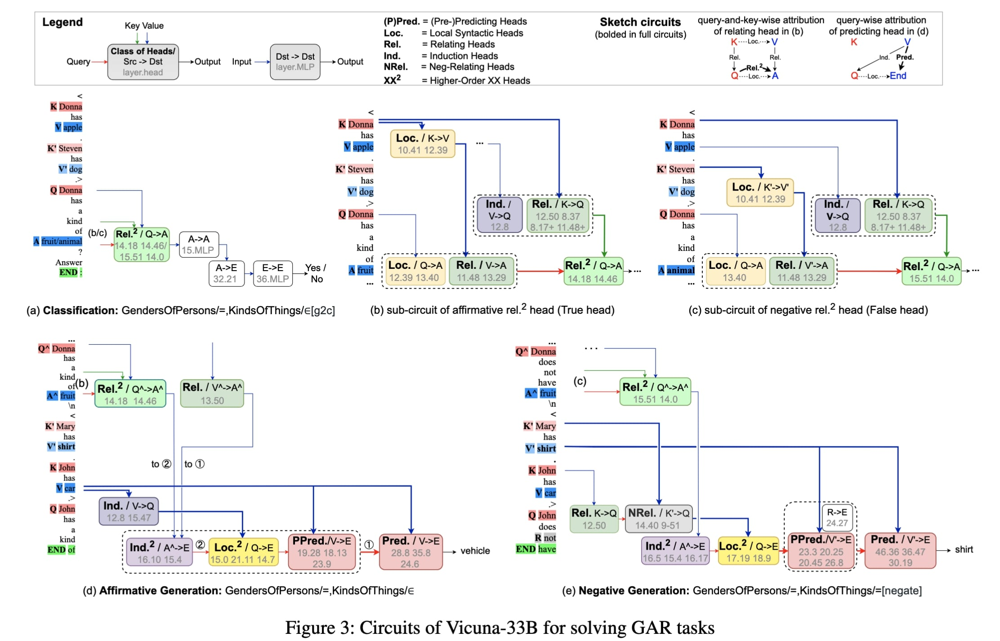

# GAR 

This repository contains scripts used in our paper: generating GAR datasets, extracting truthfulness features, and training MLP models.

> [**Benchmarking and Understanding Compositional Relational Reasoning of LLMs**](https://arxiv.org/abs/2412.12841)\
> Ruikang Ni, Da Xiao, Qingye Meng, Xiangyu Li, Shihui Zheng, Hongliang Liang\
> AAAI 2025 

- **GAR Framework**


- **Vicuna Circuits For GAR**


## About

<strong>C</strong>ompositional <strong>R</strong>elational <strong>R</strong>easoning (<strong>CRR</strong>) is a hallmark of human intelligence, but we lack a clear understanding of whether and how existing transformer large language models (LLMs) can solve CRR tasks. To enable systematic exploration of the CRR capability of LLMs, we first propose a new synthetic benchmark called <strong>G</strong>Generalized <strong>A</strong>Associative <strong>R</strong>ecall (<strong>GAR</strong>) by integrating and generalizing the essence of several tasks in mechanistic interpretability (MI) study in a unified framework. 

Evaluation shows that GAR is challenging enough for existing LLMs, revealing their fundamental deficiency in CRR. Meanwhile, it is easy enough for systematic MI study. Then, to understand how LLMs solve GAR tasks, we use attribution patching to discover the core circuits reused by Vicuna-33B across different tasks, and a set of vital attention heads. Intervention experiments show that the correct functioning of these heads significantly impacts task performance. Especially, we identify two classes of heads whose activations represent the abstract notion of true and false in GAR tasks respectively. They play fundamental roles in CRR across various models and tasks.

The project structure is organized into several folders, each serving a specific purpose, as outlined below.

## Folder Structure

```
code_and_data
├── GAR
│   ├── code
│   │   ├── data.py
│   │   ├── GAR_utils.py
│   │   ├── generate_GAR.py
│   │   └── landmark_in_country_clean.json
│   └── data
│       └── GAR_data.jsonl
├── MLP
│   ├── code
│   │   ├── get_features.py
│   │   └── train_and_test_MLP.py
│   └── data
│       ├── GoT_one_shot
│       │   ├── cities.jsonl
│       │   ├── companies_true_false.jsonl
│       │   ├── counterfact_true_false.jsonl
│       │   └── sp_en_trans.jsonl
│       ├── GoT_zero_shot
│       │   ├── cities.csv
│       │   ├── cities.jsonl
│       │   ├── companies_true_false.csv
│       │   ├── companies_true_false.jsonl
│       │   ├── counterfact_true_false.csv
│       │   ├── counterfact_true_false.jsonl
│       │   ├── sp_en_trans.csv
│       │   └── sp_en_trans.jsonl
│       ├── SNLI_one_shot
│       │   └── snli_YesNo_head_feature_3000_test_one_shot.jsonl
│       └── SNLI_zero_shot
│           ├── snli_YesNo_head_feature_3000_test_zero_shot.csv
│           ├── snli_YesNo_head_feature_3000_test_zero_shot.jsonl
│           ├── snli_YesNo_head_feature_3000_train_zero_shot.csv
│           ├── snli_YesNo_head_feature_3000_train_zero_shot.jsonl
│           ├── snli_YesNo_head_feature_3000_validation_zero_shot.csv
│           └── snli_YesNo_head_feature_3000_validation_zero_shot.jsonl
└── README.md
```

**GAR**: 

- **code:**  Contains code for generating GAR data (**GAR_utils.py **and **generate_GAR.py**),  as well as foundational data.
- **data:**  Contains GAR examples generated by **generate_GAR.py**,  with 4608 entries.

**MLP:**

- **code:**  Contains code for training models (**train_and_test_MLP.py**) and for extracting features (**get_feature.py**).
- **data:**  Contains four folders,  *GoT_zero_shot* and *SNLI_zero_shot*, which contain JSONL files used for extracting GoT/SNLI features; and CSV files containing the extracted features. *GoT_one_shot* and *SNLI_one_shot* contain GoT/SNLI data used for model testing.

## How to Use

### 1. Generate GAR Data （Corresponding paper section: Evaluating LLMs on GAR）

To generate the GAR dataset, run the following command:

```
python GAR/code/generate_GAR.py --cache_dir 'Your cache_dir' --model_name 'Your model_name'
```

**Parameters:**

***Necessary:***

--cache_dir:  Sets the directory path for storing or accessing local model files.

--model_name:  Indicates the name of the model being used.  (e.g.  lmsys/vicuna-33b-v1.3).

***optional:***

--nrows:  Specifies the number of rows contained in each data sample.  (default: 2)

--k_shot:  Indicates the number of rows used for k-shot learning examples, must be less than **nrows**.   (default: 1)

--cxt_len:  Defines the number of key-value pairs in each sample.  (default: 3)

--batch_size:  Determines the number of samples generated per relation.  (default: 8)

--proxies:  Configures network proxy settings. (default: None)

--device:  Specify the CUDA device index. (e.g., 0 for cuda:0) (default: 0)

--only_load_tokenizer:  Loads only the tokenizer without the entire model if set to true, otherwise loads both.   (default: False)

### 2. Train and Test MLP（Corresponding paper sub-section: The efficacy of True/False Heads in Other Datasets）

#### 2.1. Extract Features

To extract features from the dataset using the pre-trained Vicuna-33B model, run the following command:

```
 python MLP/code/get_feature.py --cache_dir 'Your cache_dir' --model_name 'Your model_name' --file_path 'Your data path'
```

**Parameters:**

***Necessary:***

--cache_dir:  Sets the directory path for storing or accessing local model files. 

--model_name:  Indicates the name of the model being used. (e.g. lmsys/vicuna-33b-v1.3) 

--file_path:  Specifies the path to your data file. (e.g.    ./MLP/data/SNLI_zero_shot/snli_YesNo_head_feature_3000_test_zero_shot.jsonl)

***optional:***

--proxies:  Define your proxy settings.  (default: None)

--device:  Specify the CUDA device index. (e.g., 0 for cuda:0)  (default: 0)

--lhs:  Defines the specific layer and head pairs you wish to extract. (default: [(15,51),(14,1),(14,7),(14,0),(17,3),(18,11),(14,18),(14,46)])

#### 2.2. Train MLP Model

To train the MLP model using one of the provided datasets, use the following command:

```
python MLP/code/train_and_test_MLP.py --dataname SNLI
```

**Optional datanames:**

- **SNLI**
- **cities**
- **sp_en_trans**
- **companies_true_false**
- **counterfact_true_false**

**Parameters:**

***Necessary:***

--dataname:  You can select the above 5 datanames.

***optional:***

--epochs:  Specify the number of training epochs. (default is 30)

--lr:  Specify  learing rate. (default is 1e-3)

--device:  Specify the CUDA device index. (e.g., 0 for cuda:0)

--lhs:  Defines the specific layer and head pairs you wish to extract. (default: [(15,51),(14,1),(14,7),(14,0),(17,3),(18,11),(14,18),(14,46)])


## Requirements

PyTorch 2.3.1

Huggingface Transformers 4.36.0

Required model: Vicuna-33B-v1.3

